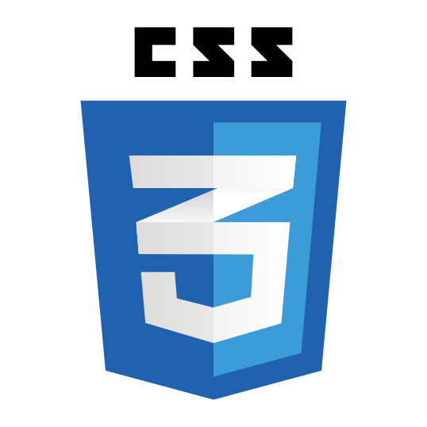
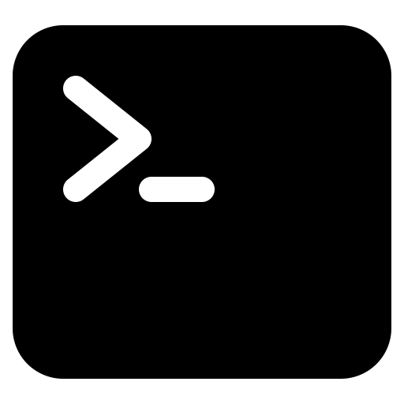

<h1 align="center">
 Hi, I’m Mounir</h1>
<h2 align="center">
a Web Developer </h2>

  <h3>About me</h3>

- Obsessed with creating new websites
- My main focus is to be fullstack developer
- I'm currently learning React js / laravel

<h3>Technologies:</h3>

<h3>Tools: </h3>

<h3>Stay In Touch 👋</h3>

<!--
**mounir-m4/mounir-m4** is a ✨ _special_ ✨ repository because its `README.md` (this file) appears on your GitHub profile.

Here are some ideas to get you started:

- 🔭 I’m currently working on ...
- 🌱 I’m currently learning ...
- 👯 I’m looking to collaborate on ...
- 🤔 I’m looking for help with ...
- 💬 Ask me about ...
- 📫 How to reach me: ...
- 😄 Pronouns: ...
- ⚡ Fun fact: ...
-->
